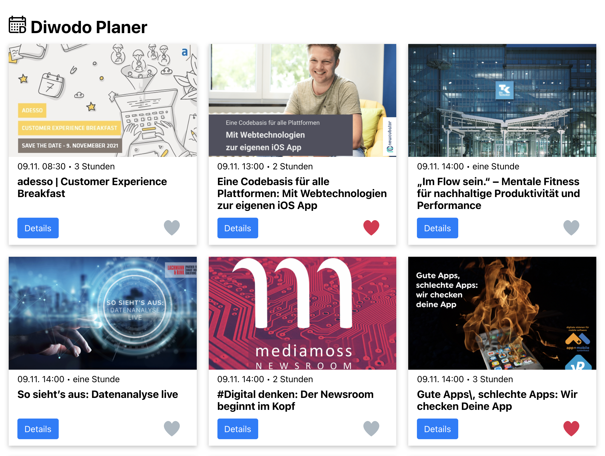

# Diwodo Planer

Beispiel Webanwendung für unseren [#DIWODO21](https://diwodo.de/) Vortrag ["Mit Webtechnologien zur eigenen iOS App"](https://newcubator.com/diwodo2021/).

In unserem Vortrag lernt ihr wie einfach es ist aus einer bestehenden Webanwendung wie dieser mit [Capacitor](https://capacitorjs.com/) eine iOS App für iPhone oder auch eine Android App machen könnt.

